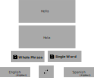

# Translator (Text)

## Summary

One of the most common needs when learning a language is to be able to quickly translate words and phrases to and from your target language. An example would be pasting "hola" into a translation app to find out that it means "hello" in Spanish. This feature is included in Boom so that the user's translation history can be integrated with other features, such as the `cards` feature. While it is mostly just be a pass-through to another translation API, the ability to intercept this traffic and save words that the user wants to remember later makes this a valuable feature.

## Motivation

Switching between apps is not part of an integrated language learning experience and must be avoided. By including a translation feature in Boom, allows the user to translate words and phrases without leaving the app.

The user benefits because they can review their previous translations, save the entire translation as a card for later review, or even pick and choose words within a pasted phrase to save as cards.

This feature can also be integrated into other views within Boom.

### Goals

- Provide a translation interface where the user can paste text and receive a translation
- Allow fast switching between the current target language and the user's native language
- Store the translation history
- Allow saving of cards from translations (entire phrase)
- Allow saving of cards from translations (single words within translation)

### Non-Goals

Out of scope:

- How local translation history is synced with server. See `storage` blueprint.
- How cards are saved. See `cards` blueprint.

## Proposal

1. Create the `src/component/Translator.tsx` component that allows you to paste text and receive a translation, and switch languages.

2. Provide hooks in the `Translator` component for:

- Saving translation history
- Saving cards

3. Add the page `pages/translator/index.tsx` to display the translator component and feed data into it.

## Design and implementation details

### `Translator` Component

The `Translator` component contains the following elements:

Name | Type | Description
-----|------|------------
Left   | TextArea | Left-hand side (text to translate)
Right  | Text  | Right-hand side (translated text)
SwapButton | Button | Button to swap the languages
SaveCard | Button | Button to save the translation as a card
SaveSingleCard | Button | Button to save a single word as a card. On click, select word(s) from each side

It accepts these props from the parent:

Name | Type | Description
-----|------|------------
`translate` | `(prompt: string, promptLanguage: string, responseLanguage: string) => (response: string)` | Request a translation from the server.
`saveCard` | `(front: string, back: string) => void` | Save a card to the server.

It maintains the following internal state:

Name | Type | Description
-----|------|------------
`left` | `string` | Current text in left box. SwapButton flips this with right.
`leftLanguage` | `string` | Language of text in left box
`right` | `string` | Current text in right box
`rightLanguage` | `string` | Language of text in right box. SwapButton flips this with left.

Internally, there is a list of supported languages and a hardcoded default value for the left and right languages at first render.

### Server-Side Routes

The routes for the Translator will be stored in a tRPC router called `translator`.

#### translator.translate

Accepts the following arguments:

Argument | Type | Description
---------|------|------------
`prompt` | `string` | User-defined string to translate
`promptLanguage` | `string` | Language of string to translate
`responseLanguage` | `string` | Language to translate into

Calls Google Translate API and returns a string representing the translated text.

Side effect: Saves the translation to the database for this user.

`onSaveCard` | `(front: string, back: string) => void` | Handler when the user saves a card. Called with `(front, back)`.

#### translator.saveCard

Argument | Type | Description
---------|------|------------
`front` | `string` | Front of the card
`back` | `string` | Back of the card

Returns nothing.

Side effect: Card object created that is tied to the currently logged-in user.

## Alternative Solutions

An intent to another app to provide the translation could work, but the experience would likely feel clunky. It may not be possible to control how/when the user returns to the app and it's possible that they'll get distracted and forget to come back.

Not including this feature at all would require the user to manually switch between apps to translate text when working on a project.
