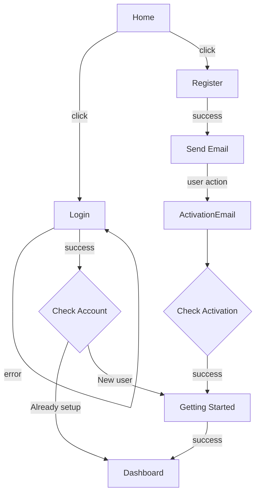

# User Accounts

## Summary

Boom needs a way for people to create and login to accounts. This allows data generated by each person to be associated with them and not mixed in with everyone else's data. The user creates an account using an email and password. They receive a confirmation email and confirm their account, then are able to login with the email and password provided. Upon first sign-in, information such as Display Name, Native Language, and Target Langauge are collected.

## Motivation

If we have no user accounts, there's no way to track data for each user.

With user accounts, there is potential for social interaction between users on the site.

### Goals

- Users can create accounts
- Users must activate account via email before using it
- Users can reset password

### Non-Goals

Out of scope:
- For now, social login is out of scope (too complex / too much setup)

## Proposal

- Add a registration page asking for email, password, and password confirmation.
- When handling form submission, create user in DB and send email with activation code link.
- On the activation route, check the token for validity.
  - If valid, set account active and redirect. 
  - Otherwise, display failure message.
- User can login using email and password, receiving an auth token.
- User can logout by deleting the auth token.

## Design and implementation details

### User Story

Actor | Action | Design/Link
------|------- | ------
User | goes to home page and clicks Sign Up | [Home Page](#home-page)
User | fills out Register Page | [Register Page](#register-page)
System | creates user in DB and sends an email | [Register Route](#register-route)
User | checks their email and clicks a link | [Email Template](#email-template)
System | checks code and activates user | [Activate Route](#activate-route)
User | fills out Getting Started (name, first LanguagePair) | [Getting Started Page](#getting-started-page) 
System | redirects and displays dashboard | [Dashboard Page](#dashboard-page)
User | clicks log out. | [Dashboard Page](#dashboard-page)
System | unsets session cookie if present | [Logout Route](#logout-route)
User | tries to login. | n/a
User | clicks the Forgot Password link. | 
User | enters their email. | 
System | checks whether the email is valid and sends a password reset email. | 
User | checks their email and clicks the reset link. | [Forgot Password Page](#forgot-password-page)
System | shows | 

### Pages

#### Dashboard Page

This page must contain a welcome message that can be checked by the integration test.

#### Email Template

This email contains a link to the [Activate Route](#activate-route) with a token as a GET variable.

#### Forgot Password Page

On this page, the user types in their email and hits submit to send a request to the [Reset Password Request Route](#reset-password-request-route).

#### Getting Started Page

On the page, the user sets up their display name and first LanguagePair. These are saved to their profile upon creation.

Upon submission, this page will submit to the [Onboard User](#onboard-user) route.

#### Home Page

The home page will contain sign up and login buttons somewhere.

If the user is already logged in, it will redirect to the dashboard.

#### Login Page

On this page, the user types in their email and password and presses enter / clicks the submit button. On success, they are redirected to either the [Getting Started Page](#getting-started-page) or the [Dashboard Page](#dashboard-page)

#### Register Page

This page lets the user register. The fewest fields possible are included to get the user signed up as quickly as possible. Additional fields will be filled in after the user activates their account.

It contains the following fields:

- Email
- Password
- Password Confirmation

### Routes

#### Logout Route

#### Register Route

TODO - make sure everything below this line has been accounted for in the [User Story](#user-story)

----

### Routes

**AKA: Create User Route**

TODO

#### Activate Route

#### Login Route

#### Reset Password Request Route

#### Change Password Route

#### Onboard User

### DB Design

Only the basic tables required for user accounts and language selection will be included in this design doc.

#### User

User is implemented using a Prisma schema.

Field | Type | Description
------|------|------------
id | Int | Auto-incremented unique id
created | DateTime | Time of registration
email | String | Unique email
passwordHash | String | Hashed password
passwordSalt | String | Salt for password
interfaceLanguage | Language | Language that the user prefers to display the application in

#### LanguagePair

Field | Type | Description
------|-----|------------
id | Int | Auto-incremented unique id
user | User | User who is learning this LanguagePair
source | Language | Language you already know
target | Language | Language you are learning

#### Language

Field | Type | Description
-------|------|------------
id | Int | Auto-incremented unique id
name | String | Language name (English)
code | String | Three letter ISO code for the language

## Alternative Solutions

Make Boom a local-only application. It's offline all the time, or a desktop app, and there is no way for users to interact. Kinda lame.
